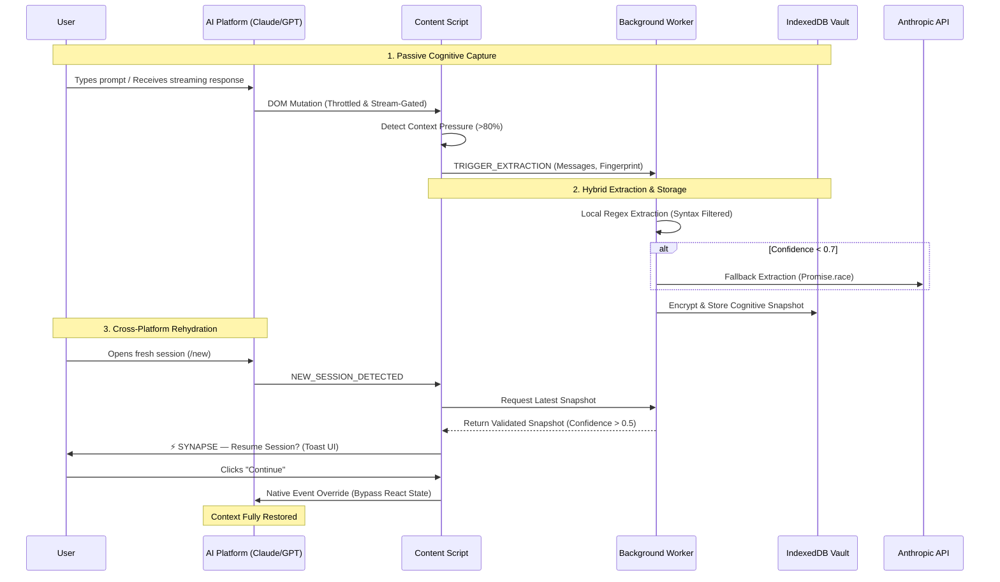

# ⚡ SYNAPSE

> **Your intelligence, portable across every AI model and account.**
> SYNAPSE eliminates AI context loss by restoring your reasoning state seamlessly across platforms, sessions, and accounts.

SYNAPSE is a reliability-focused browser infrastructure that eliminates human cognition fragmentation. It captures reasoning state from any AI conversation, extracts structured cognitive snapshots, stores them securely, and reconstructs your full context automatically when you switch accounts, models, or platforms.

## ⚠️ The Problem: Cognitive Fragmentation

Modern AI users are **multi-agent operators**. We bounce between Claude for coding, ChatGPT for brainstorming, and Gemini for research. 

Every time you switch platforms or hit an artificial rate limit, your AI loses context. You are forced to manually copy-paste code, re-explain goals, and rebuild the "cognitive state" from scratch. **This destroys workflow continuity.**

> **Imagine this:**
> You hit Claude's rate limit while debugging authentication middleware.
> You open ChatGPT on another account.
> Instead of re-explaining everything, SYNAPSE restores:
> - what you're building
> - what broke
> - what you already decided
> - and where you left off
> 
> in under 3 seconds.

## 💡 The Solution: Persistent Cognitive Continuity

SYNAPSE acts as an **invisible memory bridge** across the entire AI ecosystem. 

1. **Passive Monitoring**: SYNAPSE silently observes your active AI conversation, utilizing heuristic pressure detection to know exactly when a session is maturing.
2. **Hybrid Extraction**: Before you hit a rate limit, it extracts a "Cognitive Snapshot" (Current Goal, Active Tasks, Blockers, Decisions) using ultra-fast local heuristics with a cloud API fallback.
3. **Encrypted Storage**: Snapshots are encrypted locally at-rest via `chrome.storage.local` keys inside an `IndexedDB` vault. All cognitive snapshots remain local-first and encrypted at rest. Raw conversations are never transmitted unless fallback extraction is explicitly triggered.
4. **Seamless Rehydration**: Open a new chat on *any* supported platform. SYNAPSE detects the fresh session, matches your project via semantic Jaccard similarity, and injects your exact cognitive state natively into the DOM.

---

## 🏗️ Architecture & Magic Loop

---

## 🚀 Engineering Highlights & Defensive UX

Hackathon prototypes fail because of edge cases. SYNAPSE was architected for **controlled reliability**:

- **React Synthetic Event Bypass**: Modern AI frontends use virtualized editors and shadow DOMs. SYNAPSE hooks directly into `Object.getOwnPropertyDescriptor(window.HTMLTextAreaElement.prototype, 'value').set` to inject state without being silently scrubbed by React re-renders.
- **Streaming Mutation Gating**: The DOM observer intelligently yields to active inference (`div[data-is-streaming]`) and enforces an 800ms stabilization window to prevent half-finished reasoning snapshots mid-stream.
- **Extraction Storm Prevention**: A strict 15-second debounce cooldown prevents overlapping extraction triggers, completely protecting IndexedDB from spam and the Anthropic API from rate limits.
- **Jaccard Semantic Routing**: Project clustering avoids heavy/noisy vector embeddings in favor of rapid `intersection over union` (Jaccard similarity) on target goals. 
- **Tab-Scoped Rehydration**: Strictly tracks `tabId` via Chrome runtime messaging to avoid cross-tab contamination when users have multiple AI sessions open simultaneously.

## 🛠️ Tech Stack

- **Framework**: Plasmo MV3
- **UI**: React + Tailwind CSS
- **Storage**: IndexedDB (`idb`) + Web Crypto API (AES-GCM)
- **Validation**: Zod
- **Intelligence**: Code-Aware Local Regex + Anthropic API

## 📦 Local Development

1. Clone the repository
2. Install dependencies: `npm install`
3. Start the dev server: `npm run dev`
4. Load the `build/chrome-mv3-dev` directory in Chrome (\`chrome://extensions/\` -> Load Unpacked).

## 🔮 Roadmap

- [ ] **Team continuity**
- [ ] **Cross-device sync**
- [ ] **Local-first encrypted memory**

---
*Built for the GDG Hackathon.*
